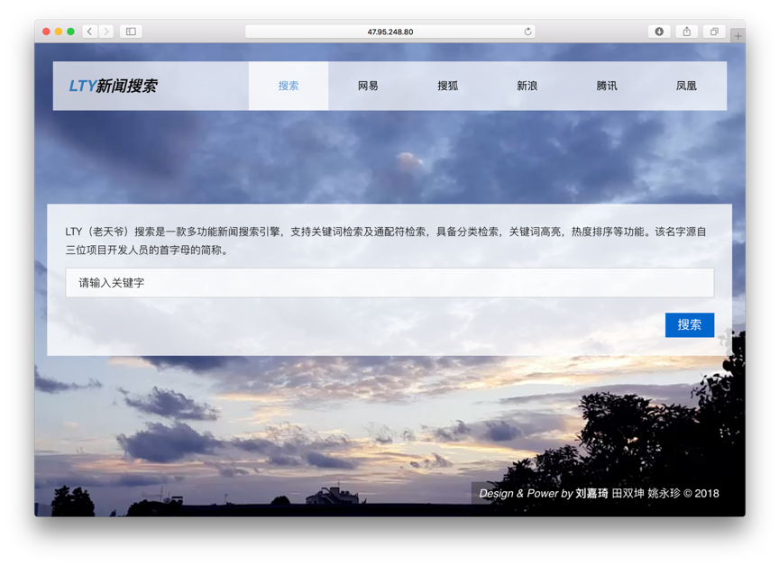
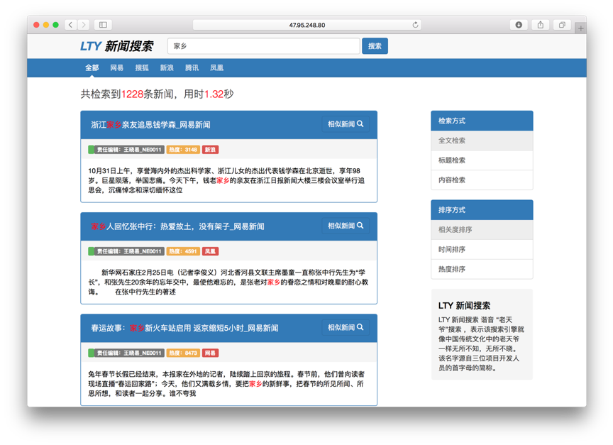

### LTY 新闻搜索
详细文档参见 [设计文档](设计文档.pdf)

#### 作业要求
(1-7个选课学生组成1队)，完成以下任务(12月份末考查)：

新闻及评论搜索：定向采集不少于4个中文社会新闻网站或频道，实现这些网站新闻信息及评论信息的自动爬取、抽取、索引和检索。
1. 新闻网页数目不少于10万页。每个新闻网页及其评论能在1天内更新。
2. 支持关键词检索及通配符检索。检索时间平均不超过2秒。
3. 能按相关度、时间、热度(需要自己定义)等属性对检索结果进行排序。能对评论的贬褒进行分析。
4. 具备查询自动补齐、相关搜索推荐、snippet生成、结果预览(鼠标移到相关结果，能预览)等功能。
5. 每条检索结果下面可以对相似新闻进行查找。
6. 首页中列举当前最热的社会新闻。

#### 演示地址
http://47.95.248.80:8089/Search/index

### 技术

- 爬虫:`Python` , `Scrapy` 
- 后端:  `Lucene `,`JAVA Servlet` 
- 前端: `Bootstrap` `,JQuery `
- 服务器: `Tomact `

#### 实现功能

- 新闻网页数目不少于10万页
- 支持关键词检索及通配符检索。检索时间平均不超过2秒
- 能按相关度、时间、热度(需要自己定义)等属性对检索结果进行排序
- 具备snippet生成、结果预览(鼠标点击新闻标题，能预览)等功能
- 每条检索结果下面可以对相似新闻进行查找
- 首页中列举当前最热的社会新闻

#### 创新点

- 垂直检索（分类检索，可以只检索对应网站、栏目的新闻内容）
- 三种检索方式（全文检索、按标题检索、按内容检索）
- 响应式布局
- 检索结果首图展示（检索结果页显示该新闻中的首张图片）
- 关键词高亮（关键字标红显示）